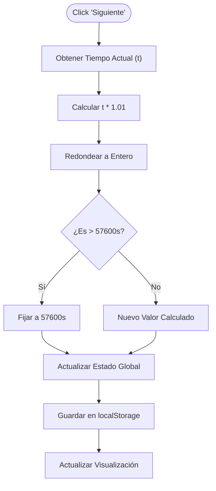
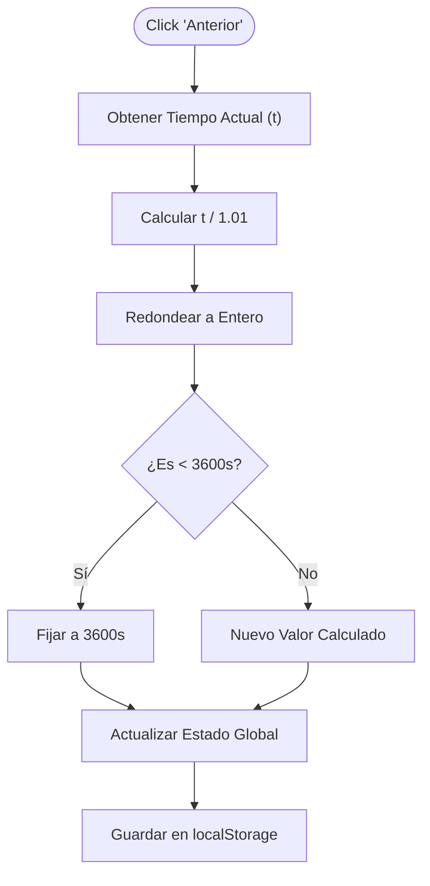
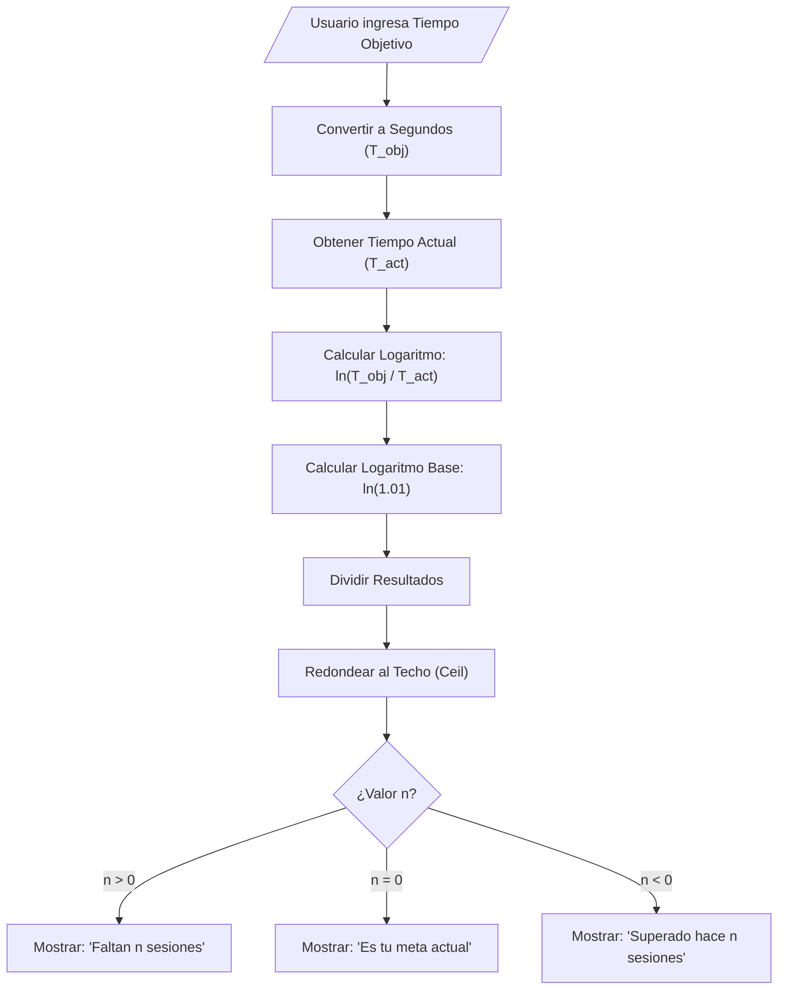
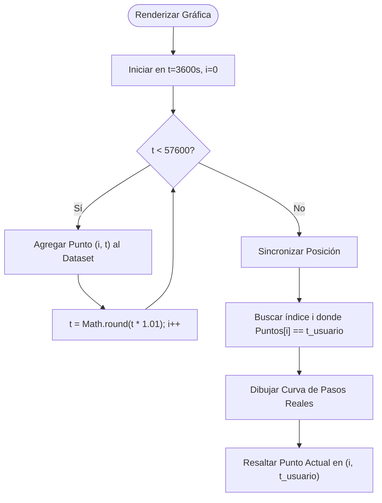

# Especificaciones Técnicas: Temporizador Exponencial

Este documento define la arquitectura, lógica algorítmica y flujos de funcionamiento para la aplicación "Temporizador Exponencial".

## 1. Patrones de Diseño y Arquitectura

Para cumplir con los requisitos de simplicidad, rendimiento y mantenibilidad, se aplicarán los siguientes patrones:

### A. Patrón de "Fuente Única de Verdad" (Single Source of Truth) con Custom Hooks
Toda la lógica del temporizador (tiempo actual, límites, cálculos) se centralizará en un *Custom Hook* (`useExponencialTimer`).
*   **Propósito:** Evitar inconsistencias entre la vista del temporizador, la gráfica y la calculadora.
*   **Funcionamiento:** El hook expone el valor del tiempo y las funciones modificadoras (`incrementar`, `decrementar`). Cualquier componente que necesite estos datos los consume directamente de este hook.

### B. Patrón de Persistencia Transparente (Observer/Storage Adapter)
La persistencia no debe requerir una acción manual ("Guardar").
*   **Diseño:** Un efecto secundario (Side Effect) observa los cambios en la variable de tiempo. Cada vez que esta cambia, el valor se serializa y se guarda inmediatamente en `localStorage`.
*   **Recuperación:** Al cargar la aplicación (Lazy Initialization), el estado inicial se lee del almacenamiento antes de renderizar la UI por primera vez.

### C. Estrategia de Validación de Límites (Boundary Validation)
En lugar de validar en la interfaz de usuario, la lógica de negocio debe encapsular las reglas de dominio.
*   **Regla:** El tiempo $t$ siempre debe cumplir $3600s \le t \le 57600s$. Ninguna función puede producir un estado fuera de este rango.

---

## 2. Flujos Funcionales y Algoritmos

A continuación se detallan los algoritmos específicos y el diagrama de flujo para cada funcionalidad crítica.

### Función 1: Inicialización del Sistema (Carga de Datos)

**Descripción del Algoritmo:**
1.  **Lectura:** El sistema intenta leer la clave `timer_value` del almacenamiento local del navegador.
2.  **Verificación de Existencia:**
    *   Si el valor **existe**: Se intenta convertir a número entero.
    *   Si el valor **no existe (null)**: Se asigna el valor por defecto: 3600 segundos (1 hora).
3.  **Sanitización (Safety Check):**
    *   Si el valor recuperado es menor a 3600 (1h) o mayor a 57600 (16h) (posible corrupción de datos), se restablece forzosamente a 3600.
    *   Si el valor es válido, se carga en el estado de la aplicación.
4.  **Renderizado Check:** Se marca la aplicación como "Lista" para mostrar la interfaz.

```mermaid
flowchart TD
    Start(( "Inicio App" )) --> ReadStorage[ "Leer localStorage" ]
    ReadStorage --> Exists{ "¿Existe Valor?" }
    Exists -- No --> SetDefault[ "Establecer Default: 3600s" ]
    Exists -- Sí --> Parse[ "Parsear a Entero" ]
    Parse --> Validate{ "¿Es Válido?" }
    Validate -- "Rango Incorrecto" --> SetDefault
    Validate -- "Rango Correcto" --> SetState[ "Establecer Estado App" ]
    SetDefault --> SetState
    SetState --> Render[ "Renderizar UI" ]
    Render --> End(( "Fin" ))
```

### Función 2: Calcular Siguiente Sesión (+1%)

**Descripción del Algoritmo (Crecimiento Exponencial):**
1.  **Entrada:** Se toma el tiempo actual en segundos ($t_{actual}$).
2.  **Cálculo:** Se aplica el factor de crecimiento del 1% (multiplicador 1.01).
    *   Fórmula: $t_{nuevo} = t_{actual} \times 1.01$.
3.  **Redondeo:** Como el tiempo se maneja en segundos enteros, el resultado se redondea al entero más cercano.
4.  **Validación de Límite Superior (Clamping):**
    *   Se compara el resultado con el Tiempo Máximo (16 horas = 57600 segundos).
    *   Si $t_{nuevo} > 57600$, entonces $t_{nuevo} = 57600$.
5.  **Persistencia:** Se actualiza el estado y se guarda en almacenamiento.



### Función 3: Calcular Sesión Anterior (-1%)

**Descripción del Algoritmo (Decrecimiento Inverso):**
1.  **Entrada:** Se toma el tiempo actual en segundos ($t_{actual}$).
2.  **Cálculo:** Se divide por el factor de crecimiento para revertir exactamente un paso (idealmente) o reducir un 1%.
    *   Fórmula: $t_{nuevo} = t_{actual} / 1.01$.
3.  **Validación de Límite Inferior:**
    *   Se compara con el Tiempo Mínimo (1 hora = 3600 segundos).
    *   Si $t_{nuevo} < 3600$, entonces $t_{nuevo} = 3600$.
4.  **Actualización:** Se guarda el nuevo valor.



### Función 4: Calculadora de Proyección (Estimación Logarítmica)

**Descripción del Algoritmo:**
Esta función determina cuántas sesiones faltan para llegar a una meta arbitraria introducida por el usuario.

1.  **Entradas:**
    *   $T_{actual}$: Tiempo donde está el usuario hoy.
    *   $T_{objetivo}$: Tiempo al que el usuario quiere llegar (Input del usuario).
2.  **Conversión:** Convertir ambos tiempos a segundos totales.
3.  **Validación de Entrada:** Asegurar que $T_{objetivo}$ esté entre 1h y 16h.
4.  **Cálculo Logarítmico:**
    *   Se basa en la fórmula del interés compuesto: $ValorFinal = ValorInicial \times (1 + r)^n$.
    *   Despejamos $n$ (número de sesiones):
    *   $$n = \frac{\ln(T_{objetivo} / T_{actual})}{\ln(1.01)}$$
5.  **Interpretación:**
    *   El resultado $n$ se redondea hacia arriba (techos) porque no existen "medias sesiones".
    *   Si $n > 0$: Fstran $n$ sesiones.
    *   Si $n = 0$: Estás en la meta hoy.
    *   Si $n < 0$: Ya superaste esa meta hace $|n|$ sesiones.



### Función 5: Generación de Datos para Gráfica (Sincronizada)

**Descripción del Flujo:**
Para evitar que el redondeo de los segundos guardados haga que el usuario se vea "fuera de la línea", la gráfica debe generarse simulando los mismos pasos discretos que el temporizador.

1.  **Simulación de Pasos:**
    *   No se usa una función exponencial continua.
    *   Se genera un arreglo de valores `Puntos`.
    *   `Punto[0] = 3600`.
    *   `Punto[n] = Math.round(Punto[n-1] * 1.01)`.
2.  **Garantía de Consistencia:**
    *   Al usar `Math.round()` en cada iteración de la gráfica, los puntos resultantes serán **exactamente** los mismos valores que el temporizador producirá al hacer clic en "Siguiente".
3.  **Localización:**
    *   El "Punto Actual" se define buscando el índice `i` donde `Puntos[i] === tiempo_actual_segundos`.


